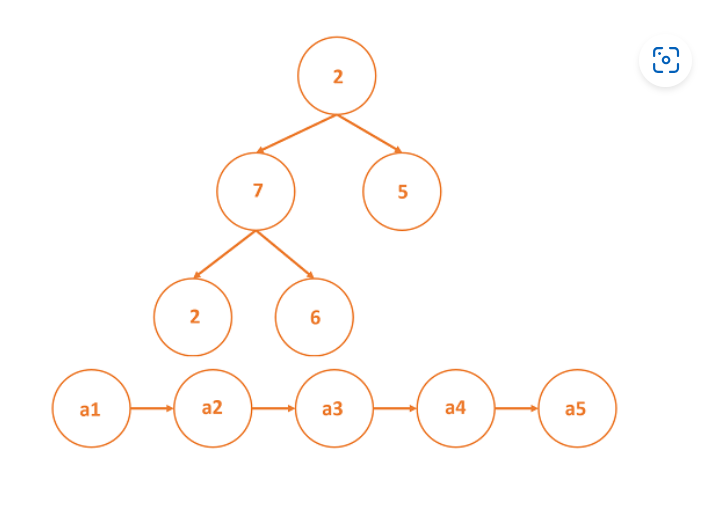
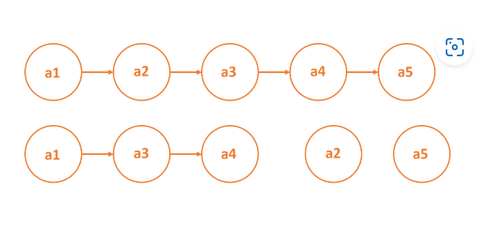

## Node: An individual part of a larger data structure

Nodes are a basic data structure which contain data and one or more links to other nodes. Nodes can be used to represent a tree structure or a linked list. In such structures where nodes are used, it is possible to traverse from one node to another node.



# Orphaned nodes

- Nodes that have no links pointing to them except for the head node, are considered “orphaned.” In the illustration, if the nodes a2 and a5 are removed, they will be orphaned.



# Null node link

- Data structures containing nodes have typically two bits of information stored in a node: data and link to next node.
- The first part is a value and the second part is an address of sorts pointing to the next node. In this way, a system of nodes is created. A NULL value in the link part of a node’s info denotes that the path or data structure contains no further nodes.

# Node Class Overview

A Node class in Java has the following attributes:

- **'public String data'** and **'private Node next'** instance variables
- a constructor that takes **'String data'** as an argument and sets the data instance variable to it as well as sets **'next'** to **'null'**
- **'.setNextNode()'** to set the next property
- **'.getNextNode()'** to access the next property

  ```java
   public class Node {

       public String data;
           private Node next;

       public Node(String data) {
               this.data = data;
               this.next = null;
           }

       public void setNextNode(Node node) {
               this.next = node;
           }

       public Node getNextNode() {
               return this.next;
           }
   }
  ```

# Node Constructor

A Node constructor should take in data as a variable. Our implementation had data as a String, but it could also be an 'int' or 'float', etc. The constructor should then:

- set the **'data'** instance variable to the passed in **'data'** variable
- set the **'next'** instance variable to **'null'**

  ```java
    public Node(String data) {
        this.data = data;
        this.next = null;
    }
  ```

# Set Next Node

A Java **'Node'** class has a **'.setNextNode()'** method that takes in a **'Node'** and updates the **'next'** instance variable appropriately.

```java
    public void setNextNode(Node node) {
        this.next = node;
    }
```

# Get Next Node
A Java **'Node'** class has a **'.getNextNode()'** method with no parameters that returns the **'next'** class property.

  ```java
    public Node getNextNode() {
        return this.next;
    }
```
